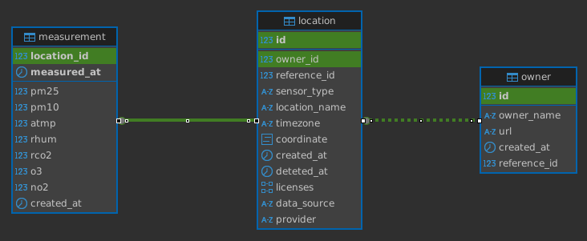

# AirGradient Map API

AirGradient Map API is a backend service that stores and serves air quality data from various sources

## Technical Overview

### Endpoints

API docs are available [here](https://map-data-int.airgradient.com/map/api/v1/docs) or if service available locally, go to http://localhost:3001/map/api/v1/docs.

### Tasks

The AirGradient Map API includes a task scheduler that runs periodic jobs (similar to cron jobs) to retrieve sensor locations and measurements from various data sources, along with other scheduled operations.

#### Sensor locations and measurements data

Since not all external platforms providing sensor data are publicly accessible, a plugin-based architecture for flexible data retrieval is implemented. Each scheduled task imports a standalone .js plugin file and calls standardized functions (latest and location) that return data in a consistent format.

**Plugin Structure:**

Each plugin must export two async functions that return a standardized response object. The expected return format is defined in [plugin-data-source.types.ts](./src/types/tasks/plugin-data-source.types.ts):

```
async function latest() {
  let output = {
    success: false,
    count: 0,
    data: [],
    metadata: null,
    error: null,
  };

  return output;
}

async function location() {
  let output = {
    success: false,
    count: 0,
    data: [],
    metadata: null,
    error: null,
  };

  return output;
}

module.exports = { latest, location };
```

To create new data source, please follow these steps:

1. Create plugin file using [template.js](./data-source/public/template.js) as starting point
2. Add two task functions in [tasks.service.ts](./src/tasks/tasks.service.ts) that import the new plugin:
    - One task for retrieving latest measurements
    - One task for syncing location information
3. Register the data source by adding a new enum value in [data-source.ts](./src/types/shared/data-source.ts)

*For complete implementation examples, see this [folder](./data-source/public/).*

### Database

Database is PostgreSQL with 2 extensions [PostGIS](https://postgis.net/) and [pg_timeseries](https://github.com/tembo-io/pg_timeseries). PostGIS is used for everything related to geospatial data such as storing coordinates, clustering, etc. pg_timeseries is used to convert the measurements table into a time series table, that will make maintaining partition table easier. Partition duration is set to 1 week.

#### DB Schema



**Constraints**

- owner
  - `id` ➝ Primary Key
  - `reference_id` ➝ Unique Key
- location
  - `id` ➝ Primary Key
  - `reference_id` and `data_source` ➝ Unique on combination
- measurement
  - `location_id` and `measured_at` ➝ Unique on combination

**Description**

- owner ➝ store owners of every sensors available on location table
  - `id` ➝ actual owner id that provided by this service
  - `reference_id` ➝ owner id that given from data source
  - `owner_name` ➝ name of the owner
  - `url` ➝ sites of each owner
- location ➝ store sensors with each sensor have a unique properties such as coordinates, locations name, etc 
  - `id` ➝ actual location id that provided by this service when sensor pulled from source 
  - `location_name` ➝ the location name of the sensor
  - `reference_id` ➝ location id of the sensor that provided by its source 
  - `sensor_type` ➝ type of the sensor in enum type between  `Small Sensor` or `Reference`
  - `licences` ➝ license of the sensor 
  - `timezone` ➝ location timezone of the sensor in string format (eg. `Asia/Bangkok`)  
  - `coordinate` ➝ coordinate of the sensor location in postgis _Point_ data type 
  - `data_source` ➝ from which platform the sensor data is retrieved 
  - `provider` ➝ which instances/entity that provide the sensor 
- measurement ➝ store sensors measurements data 

## License

This project is licensed under the GNU General Public License v3.0 (GPL-3.0).
